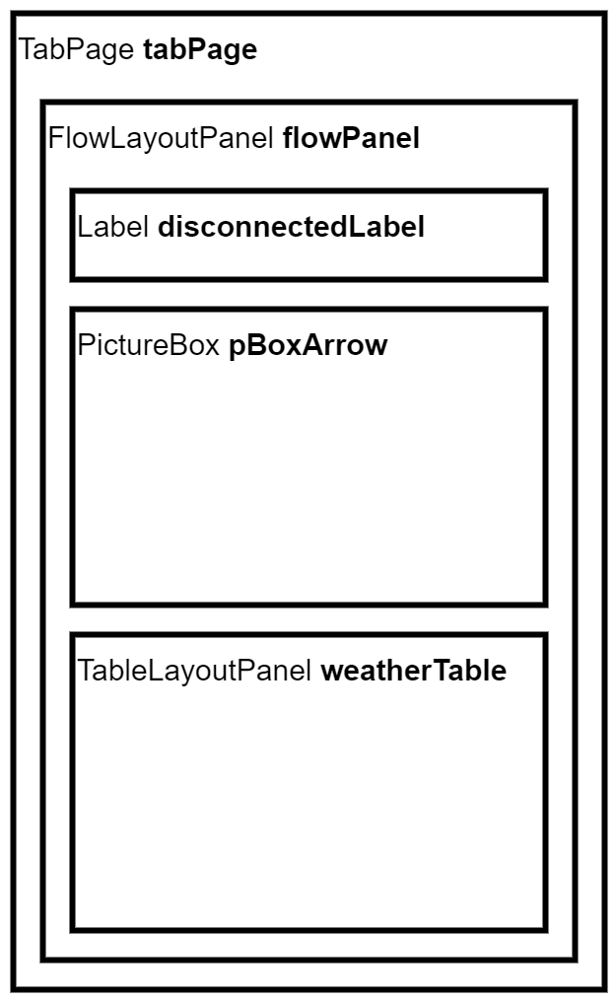

# RACPluginUDPWeatherStation

Plugin that listens to UDP boradcast messages from the weather station.

 - Tab visibility can be set by right clicking on the tab header and selecting "**Customize**"
 - Plugins can be dis- and re-enabled on the **Plugin Manager** screen (**Ctrl+C**)

## UI extension

The plugin adds the following tabpage structure to the tabpages on the Flight Data screen (called `Weather`):



 - `disconnectedMessageLabel`: Informs the user if the connection to the weather station is lost (and how many seconds ago)
 - `pBoxArrow`: Displays an arrow pointing in the direction of the wind
 - `weatherTable`: Displays the received weather data in a tabular form

The tab is inserted at the second place between the tabs, and is visible on first start.

```cs
// Setup tabpage
tabPage = new TabPage();
tabPage.Name = "tabWeather";
tabPage.Text = "Weather";
int index = 1;
List<string> list = Settings.Instance.GetList("tabcontrolactions").ToList();
list.Insert(index, "tabWeather");
Settings.Instance.SetList("tabcontrolactions", list);
Host.MainForm.FlightData.TabListOriginal.Insert(index, tabPage);
Host.MainForm.FlightData.tabControlactions.TabPages.Insert(index, tabPage);
```

## UDP broadcast handling

An (asynchronous) UDP listener is set up to listen on a set port number for broadcast messages.

```cs
// Setup UDP broadcast listener
int PORT = 3333;
IPEndPoint iPEndPoint = new IPEndPoint(IPAddress.Any, PORT);
UdpClient udpClient = new UdpClient(PORT);
udpClient.BeginReceive(new AsyncCallback(PorcessMessage), null);
```

The callback function `PorcessMessage` then handles the incomming message.

```cs
// UDP Client callback function
private void PorcessMessage(IAsyncResult result)
{
    // Get message
    string message = Encoding.UTF8.GetString(udpClient.EndReceive(result, ref iPEndPoint));

    // Restart listener
    udpClient.BeginReceive(new AsyncCallback(PorcessMessage), null);

    // Process message
    Console.WriteLine($"UDP broadcast on port {PORT}: {message}");
    LogMessage(message);
    DisplayMessage(message);
}
```

The message is read into the `message` variable, the listener is reset, then the `LogMessage` and `DisplayMessage` functions log and display it on the UI respectfully.